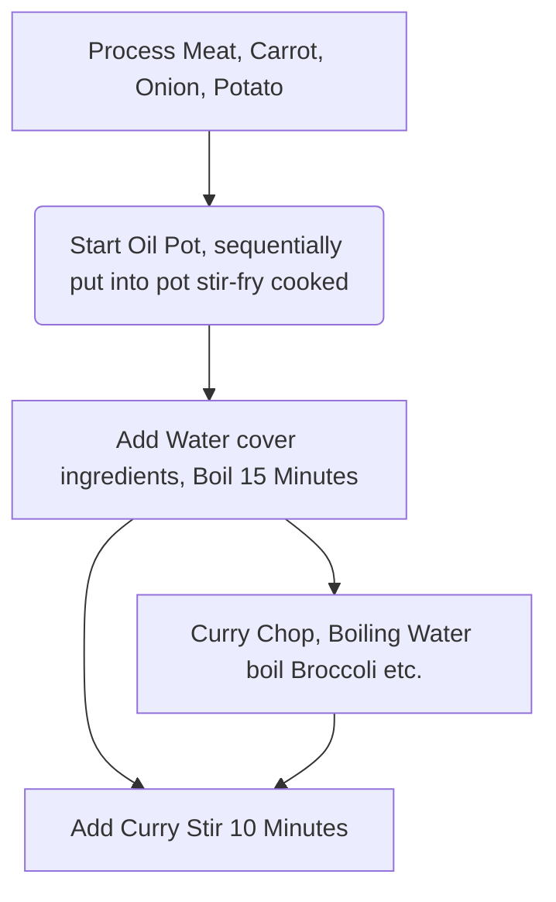

# Japanese Curry Rice

Estimated Cooking Difficulty: ★★★★

## Essential Ingredients and Tools

### Main Ingredients

- Curry Block (Recommend brand House)
- Potato
- Carrot
- Onion
- Meat (Pork, Chicken, Beef all okay)
- Garlic Clove

### Side Ingredients

Extra ingredients used for garnish, optional

- Broccoli (Boiled in clear water)
- Bacon (Ready-to-eat)
- Fried Egg or [Sunny Side Up Egg](../../breakfast/Sunny_Side_Up_Egg.md)

## Calculations

Ingredient usage proportional to curry, calculation part take **Half Box House Curry Block (115g)** as example. Half box about six bowls portion, made curry flavor better after refrigerated in fridge, don't worry one person cannot finish eating.

- Onion 2
- Potato 2
- Carrot 1
- Garlic Clove 2~3
- Meat 1 kg

## Operation

### 1. Ingredient Preparation

- Carrot remove head and tail, peel, rolling cut
- Onion peel off outer layer remove core, cut into crescent shape
- Potato peel, cut big chunks
- Meat cut block shape
- Peel garlic squash flat chop
- Curry Block chop, increase contact area accelerate dissolve

### 2. Cooking Process

- Hot oil pot put in Garlic and Meat, **Quickly Stir-fry** until meat *Surface turns white*
- Add Carrot, **Quickly Stir-fry** until evenly heated
- Add Onion, **Quickly Stir-fry** until Onion *Turns transparent state*
- Add Potato, maintain stir-fry until Potato *Turns soft* (Can use chopsticks to confirm)
- Add water cover all ingredients, after boiling **Wait 15 Minutes**
- Turn off heat, add curry and stir
- Wait curry melt then turn on heat, slowly **Stir 10 Minutes**, prevent sticking pot
- When appearance *Presents viscous state* turn off heat end production

### 3. Heat After Refrigeration

Refrigerated curry each time take out portion needed to eat, after heating cover on [Rice](../Rice/Rice_Cooker_Steamed_Rice.md).

- Microwave: Single person portion High Fire 2-3 minutes
- Pot: Need extra add 50ml Water, maintain stir when heating

## Additional Content

### Remarks

- Step 1-6 can proceed during waiting process of 2-5, in this process can also use clear water pot boil some vegetables, or make a fried egg.
- Between 2-5 to 2-6, need pay attention observe boiling water level line, if find lower than 2/3 of ingredients should add hot water to cover ingredients.

### Flow Chart

### Finished Product

### References

- [World Food Tutorial's Weibo Video](http://t.cn/EJ77yFy)

---
If you find any issues with the production process of this guide or have improvements, please raise an Issue or Pull request.
