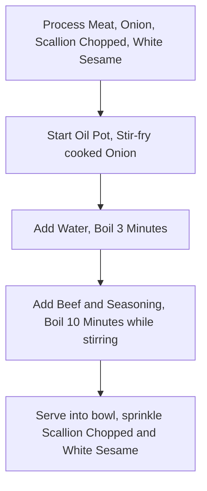

# Japanese Gyudon

Estimated Cooking Difficulty: ★★★★

## Essential Ingredients and Tools

### Main Ingredients

- Onion (Must choose Onion with white yellow outer skin, do not use purple Onion)
- Fatty Beef (Hotpot Fatty Beef is okay, also can choose Original Cut Fatty Beef Slices)
- Scallion (Also can choose cut Scallion segments)
- White Sesame
- Mirin (A kind of commonly used Japanese seasoning, can buy on major e-commerce platforms, also can use Cooking Wine substitute)

### Side Ingredients

Extra ingredients used for garnish, optional

- [Onsen Tamago](../../breakfast/Onsen_Tamago/Onsen_Tamago.md)
- Dashi (Soup stock boiled using Bonito flakes and Kombu, can be used to lift freshness)

## Calculations

Ingredient usage proportional to rice, calculation part take **One Cup Rice (160ml)** as example. About two people eating portion, can put in fridge refrigerate if cannot finish eating, but might not be that delicious

- Onion 1
- Fatty Beef 250 g
- Scallion 1~2 Plants
- White Sesame 5 g

## Operation

### 1. Ingredient Preparation

- Onion peel off outer layer remove core, cut into crescent shape
- Scallion wash clean cut into 0.5cm small segments
- Hot pot directly put in White Sesame, **Back/Forth shake pot body** make sesame evenly heated until *Slightly presents golden yellow*
- Fatty Beef blanch water 1 Minute then fish out
- Mix 40g `Mirin` (Or 30g `Cooking Wine`), 30g `Soy Sauce`, 20g `Oyster Sauce`, 5g `Sugar`, 5g `Dark Soy Sauce` (Optional, used for coloring), in bowl stir mix into `Seasoning` (This step can directly put bowl on electronic scale proceed)

### 2. Cooking Process

- Hot oil pot put in Onion, **Quickly Stir-fry** until Onion *Turns transparent state*
- Turn low heat, add 250g Water (Or Dashi), turn back high heat heat **Wait 3 Minutes**
- Add Beef and `Seasoning`
- **Constantly flip** all ingredients **10 Minutes**, prevent ingredients sticking pot
- Turn off heat
- Serve Gyudon on [Rice](../Rice/Rice_Cooker_Steamed_Rice.md) (Note need pour some juice on rice)
- Sprinkle Scallion chopped and White Sesame, production complete.

### 3. Heat After Refrigeration

Refrigerated Gyudon each time take out portion needed to eat, after heating cover on [Rice](../Rice/Rice_Cooker_Steamed_Rice.md).

- Microwave: Single person portion High Fire 2-3 minutes
- Pot: Need extra add 50ml Water, need **Constantly flip** when heating

## Additional Content

```shell
struct Staple{float Salinity;};
struct Staple Gyudon
Gyudon.Salinity = Taste a mouthful soup;
while(Gyudon.Salinity < Expectation) Add(1 g) Soy Sauce; Gyudon.Salinity = Taste a mouthful soup;
```

### Remarks

- If use relatively nice Beef, can choose not blanch water, can more retain Beef flavor, because added Mirin so won't be very fishy, no need worry Beef not cooked, heat 10 Minutes definitely cooked
- If have condition, choose add 15g`Sake`

### Flow Chart



### Finished Product


### References

- [He Shui Yang Yang Lab 【Gyudon｜Fatty Beef Rice】Yoshinoya Beef Rice Authentic Method](https://www.bilibili.com/video/BV1rK4y1d7Fk)
- [Uncle Xia Kitchen 60 seconds get divine recipe, tasty and goes well with rice Fatty Beef Rice!](https://www.bilibili.com/video/BV1xu4y1676X)

---
If you find any issues with the production process of this guide or have improvements, please raise an Issue or Pull request.
